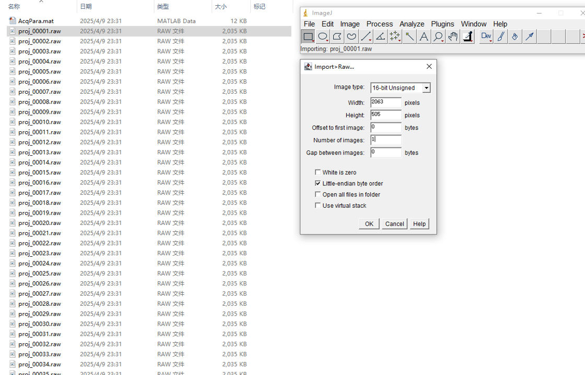
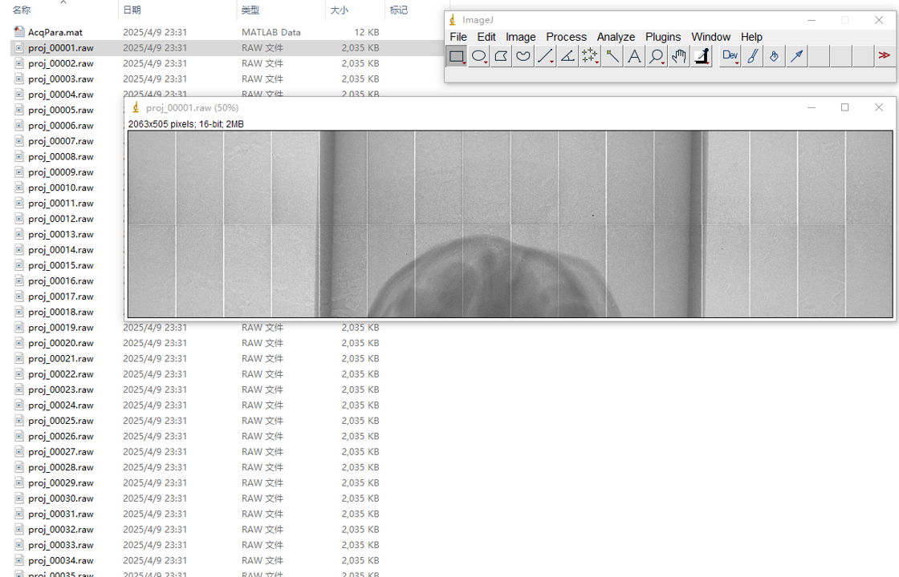

# WalnutPCCTReconCodes

This repository provides MATLAB code for loading, correcting, reconstructing, and performing spectral analysis on projection data from the **[Walnut Photon-Counting CT (PCCT) Dataset](https://zenodo.org/records/15738314)**, acquired using a custom micro-cone-beam PCCT system. The dataset includes multi-energy raw projections of 15 walnut samples.

> 📖 This repository accompanies our scientific publication:  
> **Zhou, E., Li, W., Xu, W. et al. A cone-beam photon-counting CT dataset for spectral image reconstruction and deep learning. Sci Data 12, 1955 (2025). https://doi.org/10.1038/s41597-025-06246-4**

---
## 📸 Data Examples

### 1. Visualizing Projection Data (ImageJ)

Raw projection files (`.raw`) can be opened using ImageJ:

- File → Import → Raw
- Width: 2063  
- Height: 505  
- Data type: 16-bit unsigned  
- Byte order: Little-endian  

This allows direct inspection of photon-counting projections.

<p align="center">
  
  
</p>
---

### 2. Reconstruction and Spectral Imaging Examples

Below are example results demonstrating the reconstruction workflow and spectral outputs.

#### 🔹 Reconstruction Workflow and Results

<p align="center">
  
  
</p>

- **Left:** Reconstruction pipeline overview  
- **Right:** Example reconstructed CT images  

---

#### 🔹 Material Decomposition and Virtual Monoenergetic Imaging

<p align="center">
  
  
</p>

- **Left:** Material decomposition results (shell and pulp)  
- **Right:** Virtual monoenergetic images at different energies  

---

## 🔧 System Requirements

Due to the large volume of high-resolution projection data and memory-intensive reconstruction tasks, the following system configuration is recommended:

- MATLAB R2024a or later
- 64 GB RAM or more
- GPU with CUDA support and ≥8 GB memory (e.g., NVIDIA RTX 2080 or above)
- Windows 64-bit OS (precompiled MEX files provided for this platform)

---

## 📦 Dependencies

This codebase relies on the [TIGRE Toolbox](https://github.com/CERN/TIGRE), an open-source GPU-accelerated CT reconstruction library supporting FDK and iterative algorithms.

### 🔁 Quick Installation

To automatically install and configure TIGRE, **simply run** the requirements.m file:

```matlab
requirements
```

---

## 🧩 Repository Structure
```bash
WalnutPCCTReconCodes/
├── requirements.m                  # One-click setup for TIGRE dependency
├── WalnutDataRecon.m              # Main script for projection correction and CT reconstruction
├── WalnutSpectralRecon.m          # Main script for material decomposition and VMI
├── /mexfiles/                     # Precompiled MEX files for Windows 64-bit
├── /functions/                        # Supporting functions (correction, recon, etc.)
└── /pictures/                         # sample figures
```

---

## 🚀 Core Functionalities
### 1. 🌀 Projection-Domain Correction & Reconstruction
Run the WalnutDataRecon.m to reconstruct high, low, and total energy bin images with optional artifact correction:
You can configure:
- Reconstruction algorithm (FDK, SART, MLEM, etc.)
- Angular sampling (full/sparse views)
- Energy bin (Total / High / Low)
- Whether to apply:
  - Non-uniformity correction (STEPC)
  - Ring artifact removal
  - 3D-TV denoising
### 2. 🧪 Image-Domain Spectral Reconstruction
For material decomposition and virtual monoenergetic imaging (VMI), run the WalnutSpectralRecon.m
Set monoenergetic image energies via:
```matlab
recon_para.WalnutVMI_E = 10:10:80;
```
Reconstructed results include:
- Walnut shell and pulp decomposition
- Energy-dependent VMI volumes

---

## 📊 Example Use Cases
- **Deep learning model training** for material decomposition or sparse-view reconstruction
- **Detector calibration studies** (e.g., bad pixel correction, ring artifact correction)
- **Virtual monoenergetic imaging (VMI)** synthesis for contrast analysis
- **Spectral CT algorithm benchmarking** using real PCCT data

---

## 📎 Citation
If you use this dataset or code, please cite:
> **Zhou, E., Li, W., Xu, W. et al. A cone-beam photon-counting CT dataset for spectral image reconstruction and deep learning. Sci Data 12, 1955 (2025). https://doi.org/10.1038/s41597-025-06246-4**

---

## 📮 Contact
For questions or feedback, please open an issue or contact email: zhou.en.ze@qq.com.

---

## 📑 License
This project is licensed under the MIT License.
Note: The included TIGRE framework is licensed under BSD.
